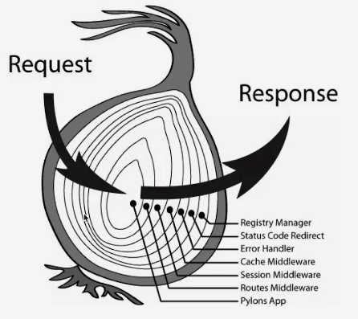

# koa

## koa-generator

```sh
npm config set registry https://registry.npm.taobao.org
npm i -g koa-generator
koa2 -e project
cd project
npm install
npm run start
npm run dev
curl http://localhost:3000
```

## koa2 中间件



```sh
mkdir middleware
cd middleware
vim koa-pv.js
```

## koa2 路由

./app.js

```js
const app = new Koa()
const users = require('./routes/users')
app.use(index.routes(), index.allowedMethods())
```

./routers/users.js

```js
const router = require('koa-router')()
router.prefix('/users') // 路由前缀
router.get('/', function (ctx, next) {
  ctx.body = 'this is a users response!'
})

router.get('/bar', function (ctx, next) {
  ctx.body = 'this is a users/bar response'
})
module.exports = router
```

## cookie/session

- cookie和session定义
- 写cookie: `ctx.cookies.set('pvid', Math.random())`
- 读cookie: `ctx.cookies.get('pvid')`

## mongoose

## koa2 核心对象

- Application 服务类
  - 创建对象 => 传入中间件use(fn) => 生成一个HTTP服务器const server => http.createServer(this.callback()) => 处理响应（handleRequest）=> 返回实例
- [学习文档：Context 上下文对象](https://github.com/demopark/koa-docs-Zh-CN/blob/master/api/context.md)
- [学习文档：Request  请求对象](https://github.com/demopark/koa-docs-Zh-CN/blob/master/api/request.md)
- [学习文档：Response 响应对象](https://github.com/demopark/koa-docs-Zh-CN/blob/master/api/response.md)
- [学习文档：Middlewares  中间件](https://github.com/demopark/koa-docs-Zh-CN#%E4%B8%AD%E9%97%B4%E4%BB%B6)

## Sequelize

### 安装 Sequelize

> Sequelize 是一个基于 promise 的 Node.js ORM, 目前支持 Postgres, MySQL, SQLite 和 Microsoft SQL Server. 它具有强大的事务支持, 关联关系, 读取和复制等功能

``` sh
$ npm install sequelize --save

安装mysql，mysql2

$ npm install mysql mysql2 --save
```

### 配置Sequelize

> 根目录下新建一个config文件，在config文件下新建一个db.js文件，这个文件就是用来建立连接mysql数据库的:

在db.js文件写入代码：

特别注意，下面代码解释：

- blogs ：数据库名字
  - 还没有创建数据库名字：登录数据库命令：mysql -uroot -p
  - 创建blogs数据库命令：CREATE DATABASE blogs DEFAULT CHARACTER SET utf8mb4 COLLATE utf8mb4_unicode_ci;
- root ：本地数据库用户名
- password ：本地数据库密码

``` js
const Sequelize = require('sequelize')

const sequelize = new Sequelize('blogs', 'root', 'password', {
    host: 'localhost',
    dialect: 'mysql',
    operatorsAliases: false,
    dialectOptions: {
        // 字符集
        charset: "utf8mb4",
        collate: "utf8mb4_unicode_ci",
        supportBigNumbers: true,
        bigNumberStrings: true
    },

    pool: {
        max: 5,
        min: 0,
        acquire: 30000,
        idle: 10000
    },
    timezone: '+08:00' //东八时区
});

module.exports = {
    sequelize
}
```

## 6. 整理项目结构

新增三个文件夹：schema（数据表模型）、modules（模型）、controllers（控制器）

分别在这三个文件夹下各新建`article.js`文件

``` js
├── schema
    └── article.js
└── modules
    └── article.js
└── controllers
    └── article.js
```

## 7. schema（数据表模型）

新建一个`schema`文件，这个文件夹的作用用来建立数据库的模型，可以先分析一下文章的字段：

|字段|说明|必填|
|--|--|--|
|id|自增文章ID|否|
|title|文章标题|是|
|author|文章作者|是|
|content|文章内容|是|
|category|文章分类|是|
|createdAt|创建时间|否|
|updatedAt|更新时间|否|

我们来做文章接口

方法一：可以在黑窗口输入创建文章表的命令：

``` sql
CREATE TABLE IF NOT EXISTS `article`(
   `id` INT UNSIGNED AUTO_INCREMENT COMMENT '主键(自增长)',
   `title` VARCHAR(100) NOT NULL COMMENT '文章标题',
   `author` VARCHAR(40) NOT NULL COMMENT '文章作者',
   `content`  TEXT NOT NULL COMMENT '文章内容',
   `category` VARCHAR(40) NOT NULL COMMENT '文章分类',
   `createdAt` DATE COMMENT '创建时间',
   `updatedAt` DATE COMMENT '更新时间',
   PRIMARY KEY ( `id` )
)COMMENT = '文章表' ENGINE=InnoDB DEFAULT CHARSET=utf8mb4;
```

方法二：使用`sequelize`管理数据库，在`schema`文件夹下起个名字`article.js`，这个文件是用创建文章数据表模型的，可以理解为：创建一张文章数据表

学习文档：[Sequelize Model definition - 模型定义 >](https://github.com/demopark/sequelize-docs-Zh-CN/blob/master/models-definition.md)

在article.js加入自动创建文章模型代码：

``` js
/**
├── schema
    └── article.js
*/
const moment = require('moment');
module.exports = function (sequelize, DataTypes) {
    return sequelize.define('article', {
        // 文章ID
        id: {
            type: DataTypes.INTEGER,
            primaryKey: true,
            allowNull: true,
            autoIncrement: true,
        },
        // 文章标题
        title: {
            type: DataTypes.STRING,
            allowNull: false,
            field: 'title',
        },
        // 文章作者
        author: {
            type: DataTypes.STRING,
            allowNull: false,
            field: 'author'
        },
        // 文章内容
        content: {
            type: DataTypes.TEXT,
            allowNull: false,
            field: 'content'
        },
        // 文章分类
        category: {
            type: DataTypes.STRING,
            allowNull: false,
            field: 'category'
        },
        // 创建时间
        createdAt: {
            type: DataTypes.DATE,
            get() {
                return moment(this.getDataValue('createdAt')).format('YYYY-MM-DD HH:mm:ss');
            }
        },
        // 更新时间
        updatedAt: {
            type: DataTypes.DATE,
            get() {
                return moment(this.getDataValue('updatedAt')).format('YYYY-MM-DD HH:mm:ss');
            }
        }
    }, {
        // 如果为 true 则表的名称和 model 相同，即 user
        // 为 false MySQL创建的表名称会是复数 users
        // 如果指定的表名称本就是复数形式则不变
        freezeTableName: true
    })
}
```

## modules（模型）使用

[学习文档：Instances - 实例](https://github.com/demopark/sequelize-docs-Zh-CN/blob/master/instances.md)

在`modules`文件夹下的`article.js`文件，使用代码创建了一个新的文章的实例：

``` js
/**
├── modules
    └── article.js
*/

// 引入刚刚在第五点建立连接mysql数据库的db.js文件
const db = require('../config/db');
// 引入Sequelize对象
const Sequelize = db.sequelize;
// 引入上一步的文章数据表模型文件
const Article = Sequelize.import('../schema/article');
// 自动创建表
Article.sync({force: false});

class ArticleModel {
    /**
     * 创建文章模型
     * @param data
     * @returns {Promise<*>}
     */
    static async createArticle(data) {
        return await Article.create({
            title: data.title, // 文章标题
            author: data.author, // 文章作者
            content: data.content, // 文章内容
            category: data.category, // 文章分类
        })
    }

    /**
     * 查询取文章详情数据
     * @param id  文章ID
     * @returns {Promise<Model>}
     */
    static async getArticleDetail(id) {
        return await Article.findOne({
            where: {
                id,
            },
        })
    }
}

module.exports = ArticleModel
```

## 9. controllers（控制器）

Controller控制器，是MVC中的部分C，此处的控制器主要负责功能处理部分：

1. 收集、验证请求参数并绑定到命令对象；
2. 将命令对象交给业务对象，由业务对象处理并返回模型数据；

在`controllers`文件夹下的`article.js`文件，加入代码：

``` js
/**
├── controllers
    └── article.js
*/
const ArticleModel = require('../modules/article')

class articleController {
    /**
     * 创建文章
     * @param ctx
     * @returns {Promise.<void>}
     */
    static async create(ctx) {
        // 接收客服端
        let req = ctx.request.body;
        if (req.title // 文章标题
            && req.author // 文章作者
            && req.content // 文章内容
            && req.category // 文章分类
        ) {
            try {
                // 创建文章模型
                const ret = await ArticleModel.createArticle(req);
                // 把刚刚新建的文章ID查询文章详情，且返回新创建的文章信息
                const data = await ArticleModel.getArticleDetail(ret.id);

                ctx.response.status = 200;
                ctx.body = {
                    code: 200,
                    msg: '创建文章成功',
                    data
                }

            } catch (err) {
                ctx.response.status = 412;
                ctx.body = {
                    code: 200,
                    msg: '创建文章失败',
                    data: err
                }
            }
        } else {
            ctx.response.status = 416;
            ctx.body = {
                code: 200,
                msg: '参数不齐全',
            }
        }

    }

    /**
     * 获取文章详情
     * @param ctx
     * @returns {Promise.<void>}
     */
    static async detail(ctx) {
        let id = ctx.params.id;

        if (id) {
            try {
                // 查询文章详情模型
                let data = await ArticleModel.getArticleDetail(id);
                ctx.response.status = 200;
                ctx.body = {
                    code: 200,
                    msg: '查询成功',
                    data
                }

            } catch (err) {
                ctx.response.status = 412;
                ctx.body = {
                    code: 412,
                    msg: '查询失败',
                    data
                }
            }
        } else {
            ctx.response.status = 416;
            ctx.body = {
                code: 416,
                msg: '文章ID必须传'
            }
        }
    }
}

module.exports = articleController
```

## 10. 路由（接口）

路由管理，大部分是接收不同的api请求，返回数据的。例如一个 `/api/v1/article`的请求，得到响应，中间件处理，返回数据。

[学习文档：Koa2的路由](https://koa.bootcss.com/#introduction)

我们在根目录下的`routes`文件夹的`index.js`文件，加入代码，这段代码可以理解为是向外暴露的API接口，实际上是路由的访问，然后通过控制器=>模型处理(数据库查询等操作)=>返回数据

``` js
/**
 ├── routes
 └── index.js
 */
const Router = require('koa-router')
const ArticleController = require('../controllers/article')

const router = new Router({
    prefix: '/api/v1'
})

/**
 * 文章接口
 */
// 创建文章接口（路由）
router.post('/article', ArticleController.create);
// 获取文章详情接口（路由）
router.get('/article/:id', ArticleController.detail);

module.exports = router
```

## 11. 开启服务

所有的文件和配置都已经弄好了，那么我们进行启动和测试：

命令进入`blog`文件夹下，重启代码：

`npm start`

启动后会出现以下代码就说明成功了：

`blog npm start`

## 12. 配置跨域

CORS是一个W3C标准，全称是"跨域资源共享"（Cross-origin resource sharing）。它允许浏览器向跨源(协议 + 域名 + 端口)服务器，发出XMLHttpRequest请求，从而克服了AJAX只能同源使用的限制。

CORS需要浏览器和服务器同时支持。它的通信过程，都是浏览器自动完成，不需要用户参与。对于开发者来说，CORS通信与同源的AJAX通信没有差别，代码完全一样。浏览器一旦发现AJAX请求跨源，就会自动添加一些附加的头信息，有时还会多出一次附加的请求，但用户不会有感觉。

因此，实现CORS通信的关键是服务器。只要服务器实现了CORS接口，就可以跨源通信。

[koa-cors学习文档](https://github.com/koajs/cors)
[npm koa-cors官网](https://www.npmjs.com/package/koa-cors)

`npm install koa-cors --save`

在根目录`app.js`文件下引入`koa-cors`


``` js
const cors = require('koa-cors');

// 使用koa-cors
app.use(cors());
```

配置好重新`npm start`运行就可

## 13. 测试接口

[postman下载地址](https://www.getpostman.com/)

一、创建文章接口

`/article`

请求方式

`POST`

参数


|参数|说明|必填|
|--|--|--|
|id|自增文章ID|否|
|title|文章标题|是
|author|文章作者|是
|content|文章内容|是
|category|文章分类|是
|createdAt|创建时间|否
|updatedAt|更新时间|否|

返回成功结果
``` json
{
    "code": 200,
    "msg": "创建文章成功",
    "data": {
        "createdAt": "2018-09-22 08:37:50",
        "updatedAt": "2018-09-22 08:37:50",
        "id": 1,
        "title": "学习koa2写接口",
        "author": "梁凤波",
        "content": "Hello Koa2!",
        "category": "nodejs"
    }
}
```

二、查询文章接口

`/article/:id`

请求方式

`GET`

参数

|参数|说明|必填|
|--|--|--|
|id|自增文章ID|是|


返回成功结果

``` json
{
    "code": 200,
    "msg": "查询成功",
    "data": {
        "createdAt": "2018-09-22 08:37:50",
        "updatedAt": "2018-09-22 08:37:50",
        "id": 1,
        "title": "学习koa2写接口",
        "author": "梁凤波",
        "content": "Hello Koa2!",
        "category": "nodejs"
    }
}
```

## 安装阅读器依赖包

- encoding": "~0.1.7"
- jsdom": "^9.12.0"
- minimist": "^1.2.0"
- request": "^2.81.0"

## 生产环境项目部署

`npm install -g pm2`

